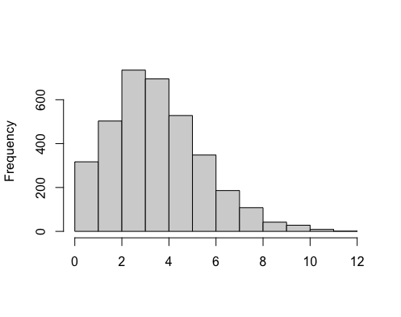
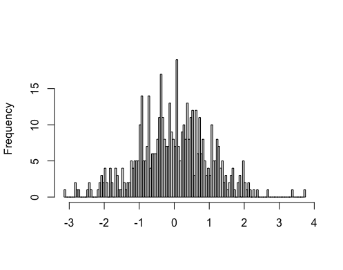
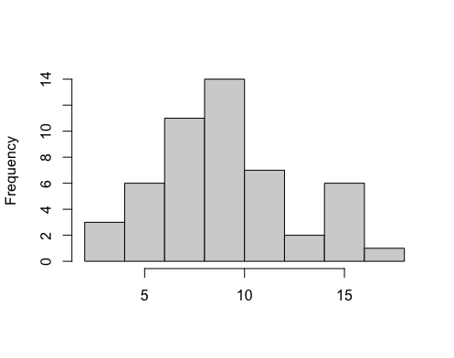
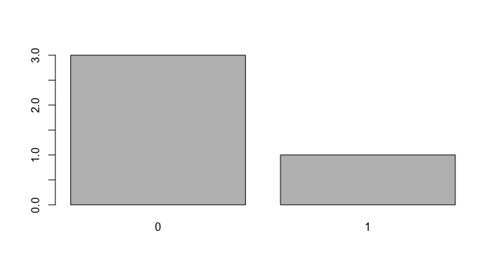
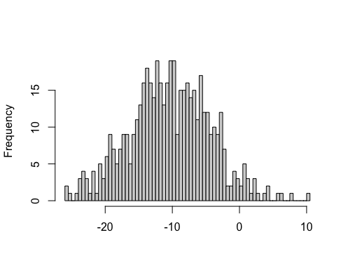

# hw2

## Question 1

To which of the main probability distributions we discussed (Binomial, Poisson, Normal) does each of these probability histograms appear to correspond? What about the image leads to your conclusion?

### Probability Histogram A



### Probability Histogram B



### Probability Histogram C



### Probability Histogram D



### Probability Histogram E



## Question 2

Given each scenario below, which probability distribution would be most appropriate?

### Scenario A

As part of collecting demographic information for a phenotypic study in mice, the mice are weighed. The collection of weights is likely distributed accordinng to which distribution?

### Scenario B

In human meiosis, a parent has two alleles, only one of which can be inherited by each gamete. According to Mendel's laws of inheritance, these are independent events with the same probability of success. Therefore, the number of gametes which inherited allele A during spermatogenesis is an example of which probability distribution?

### Scenario C

In a drug screening analysis, many drugs are used independently to treat some individual, and the individual is scored for some outcome. If the desired outcome is observed, this is considered a hit or a success. Often these hits are very rare, but we may be able to estimate the number of expected hits in any drug screen. What probability distribution is a drug screen likely to follow?

## Question 3

Provide a data scenario or biological process which is appropriate for each of main probability distributions we discussed (Binomial, Poisson, Normal).

## Question 4 -- R: Frequency Distribution, Random Variable, and Probability

I've simulated a dataset for rheumatoid arthritis (RA) patients. The dataset has 4 columns. The first is an `id` column for patient id. The second is an `age` column which stores the patient's rheumatoid arthritis symptom(s) onset age. The fourth `column` stores whether the patient has a family history of RA (0 means no, 1 means yes). The final column `weekly_exercise_hrs` records the amount of weekly exercise (in hours) that each patient gets on average. You can read the file into R using the following command.

```
ra_data <- read.csv("https://raw.githubusercontent.com/bms5213-F2021/hw2/main/rheumatoid_arthritis_dataset.csv")
```

### A -- Frequency Distribution
Using the `table()` function and the process that we used in class on 10/26, build a frequency distribution for the symptom onset age. Please provide your code and a barplot of the resulting frequency distribution.

### B -- Random Variable

Is the symptom onset age column strictly a random variable according to the technical definition we discussed? If yes, please describe what type of random variable it is. From your description & the frequency distribution, does it appear to follow one of the standard probability distributions (Binomial, Poisson, Normal)?

### C -- Probability

Use the frequency distribution to determine the following probabilities. Make sure to provide the code you use to determine each answer.

* What is the probability that in this sample, a patient's symptoms onset at the age of 50?
* What is the probability that in this sample, a patient's symptoms onset by the age of 50 (less than or equal to 50)?
* What is the probability that in this sample, a patient's symptoms onset after the age of 50 (greater than 50)?
* What is the probability that in this sample, a patient's symptoms onset at or after the age of 50 (greater than or equal to 50)?
* What is the probability that in this sample, a patient's symptoms onset before the age of 50 (less than 50)?
* What is the probability that in this sample, a patient's symptoms onset by the age of 24 (less than or equal to 24)?
* What is the probability that in this sample, a patient's symptoms onset after the age of 75 (greater than 75)?
* What is the probability that in this sample, a patient's symptoms onset after the age of 25 but before the age of 75 (25 < age < 75)?
* What is the probability that in this sample, a patient's symptoms onset sometime between the ages of 25 to 75 (25 <= age <= 75)?

## Question 5 -- R: Simulation and Hypothesis Testing

### Simulating from the Binomial distribution
#### A -- Single success possible for each trial (size=1)
```
set.seed(82)
resulting_sample <- rbinom(5000, prob=0.0005, size=1)
```

`resulting_sample` in the above code block is a vector, generated from binomial distribution, and is length 5000, recording the outcome of each of 5000 trials. The values recorded are 0's and 1's where a 1 signifies a successful trial, and a 0 signifies an unsuccessful trial. Find the sample probability of success from the sample `resulting_sample`. How does it compare to the known parameter used in the `rbinom` function?

#### B -- More than one success possible for each trial (size>1)
```
find_prob_success <- function(res_vec, n_trial, size, true_prob){
  obs_prob <- sum(res_vec)/(n_trial*size)
  return(data.frame(num_trials = n_trial, obs_success_prob = obs_prob, dif_true_obs= true_prob-obs_prob))
}

set.seed(42)
true_prob <- 0.0005
size <- 10000
trials <- c(1, 2, 3, 4, 5, 25, 30, 50, 500, 5000)
obsProbs <- do.call(rbind, lapply(1:length(trials), function(x) find_prob_success(rbinom(trials[x], prob=true_prob, size=size), trials[x], size, true_prob)))
```
I've written some generalized code above that runs this process for several different numbers of trials, but a consistent size (>1), finds the observed probability of success, and then compares it to the true probability of success parameter that was used in the `rbinom` function to generate the observed results. How does the statistic compare to the parameter for of these 10 runs? Can you make a generalized observation? If so, what?

### Hypothesis tests -- Binomial

While we're using the same function to generate these vectors of data, we may wonder if the sample statistics are equal to the population parameters or not, especially as we change the sample sizes.


* State a null hypothesis in technical terms for this.
* State an alternative hypothesis in technical terms for this.
* Pick one of the samples from either A or B above, and use the `binom.test()` function to decide if we reject or fail to reject the null hypothesis. Report the result using technical terms.
* State the outcome of the hypothesis test in non-technical terms.

### Simulating from the Poisson distribution

```
set.seed(71)
n <- 13
lambda_param <- 4
resulting_sample_pois <- rpois(n, lambda_param)
```

Find the sample lambda statistic (or mean) for the sample generated from the above code block. How does the sample mean compare to the known parameter used in the `rpois` function?

```
set.seed(73)
n <- 1000
lambda_param <- 4
resulting_sample_pois <- rpois(n, lambda_param)
```

Let's increase the sample size, using this second code block. Find the sample lambda for the sample generated from the second code block. How does the sample mean compare to the known parameter used in the `rpois` function?

### Simulating from the Normal distribution
```
set.seed(352)
resulting_sample_norm1 <- rnorm(5, mean=-30, sd=2)
```
Find the sample mean and the sample standard deviation for the sample generated from the above code block. How do they compare to the known parameters used in the `rnorm` function?

Gradually increase the sample size (using the following sample sizes: 10, 25, 50, 75, 100, 1000), storing the result in a new variable, and find the sample mean and sample standard deviation each time. Report the results in a table or dataframe (you can do this by hand, or have R do it for you.) How does each set compare to the known parameters used in the `rnorm` function?

### Hypothesis tests -- Normal, 1 sample

While we're using the same function to generate these vectors of data, we may wonder if the sample statistics are equal to the population parameters or not, especially as we change the sample sizes.

* State a null hypothesis in technical terms for this.
* State an alternative hypothesis in technical terms for this.
* Pick one of the samples from above, and use the `t.test()` function to decide if we can accept or reject the null hypothesis. Report the result using technical terms.
* State the outcome of the hypothesis test in non-technical terms.

### Hypothesis tests -- Normal, 2 sample

We may also wonder if the sample statistics from two different samples (from the same population) are equal to one another, especially as we change the sample sizes.
* State a null hypothesis in technical terms for this.
* State an alternative hypothesis in technical terms for this.
* Using the `resulting_sample_norm1` variable, pick one other of the sample variables from above, and use the `t.test()` function to decide if we reject or fail to reject the null hypothesis. Report the result using technical terms.
* State the outcome of the hypothesis test in non-technical terms.
